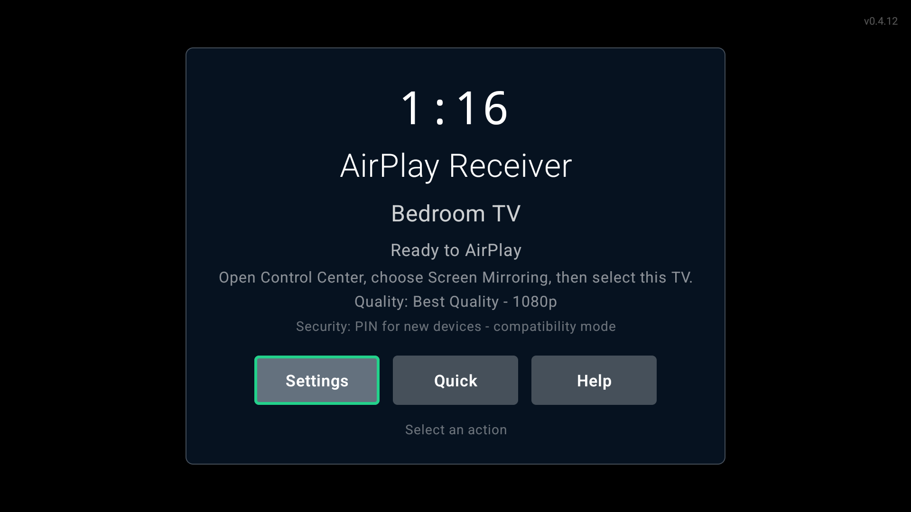
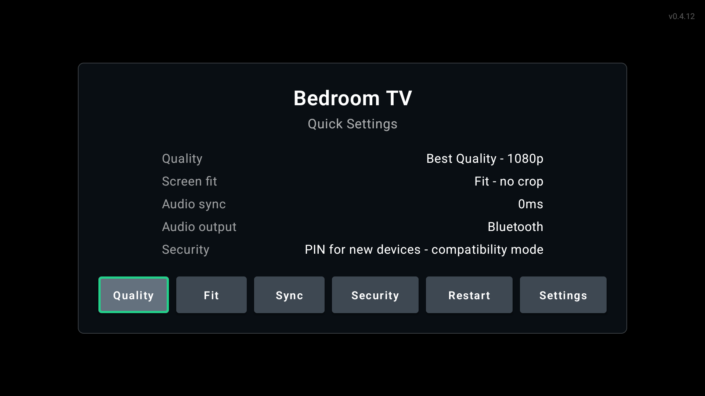
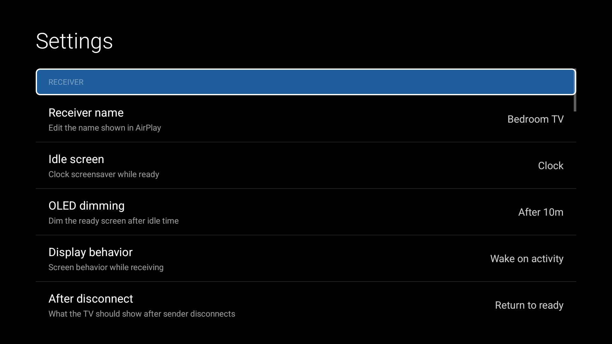
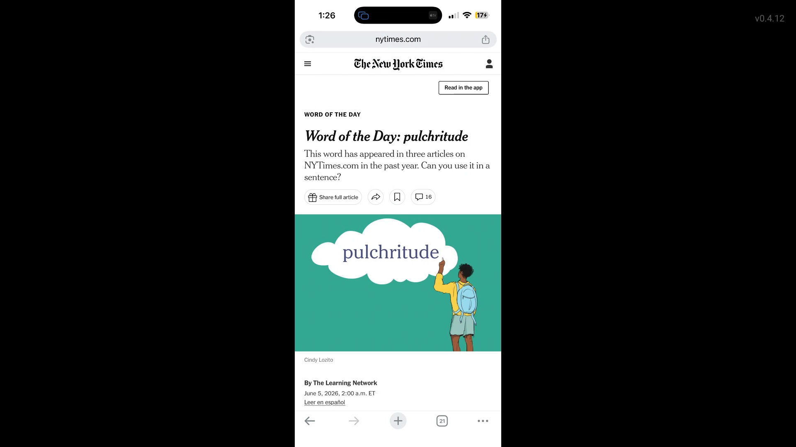
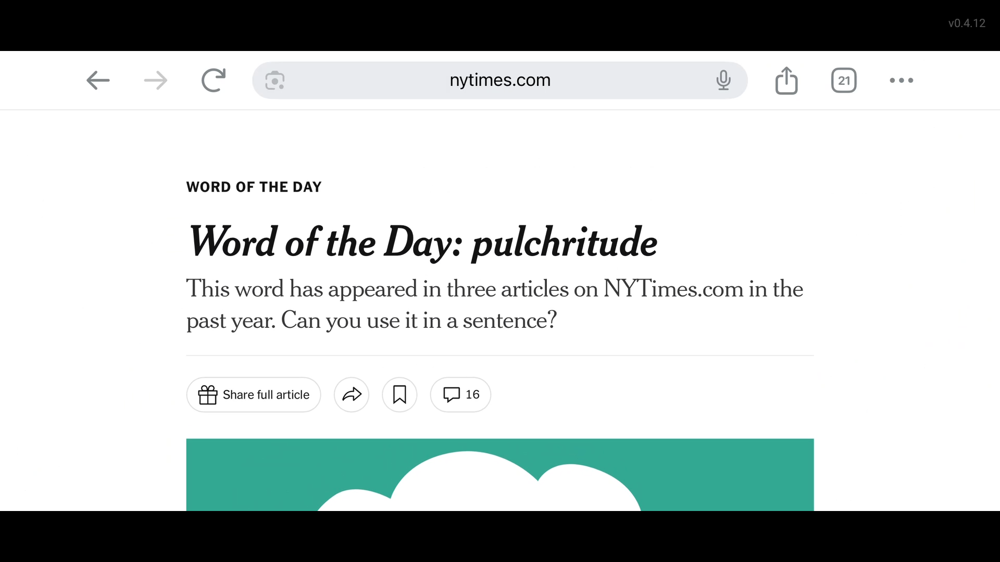

# AirPlay Receiver

AirPlay Receiver turns an Android TV or Google TV device into a local AirPlay target for screen mirroring and audio playback. It is built for a TV remote first: D-pad focus, couch-distance text, landscape-only screens, foreground-service reliability, and honest compatibility limits.

The existing native RAOP, mirroring, FairPlay, AAC/ALAC, and H.264 stack is preserved. The Android layer wraps it with TV-native onboarding, discovery, ready-state UI, quick controls, diagnostics, audio-only playback, and release packaging.

## Screenshots

| Ready screen | Quick settings | Main settings |
| --- | --- | --- |
|  |  |  |

Screenshots were captured from a Chromecast with Google TV running the release APK.

## AirPlay In Action

| Portrait mirroring | Landscape mirroring |
| --- | --- |
|  |  |

The receiver adapts to the sender orientation and preserves the source aspect ratio instead of stretching phone content to fill the TV.

## Highlights

- Android TV / Google TV positioning with Leanback launcher support and landscape-only activities.
- D-pad ready screen with clock, receiver name, quick settings, full settings, and connection help.
- First-run setup for receiver name, security preference, quality profile, and connection instructions.
- H.264 mirroring to `SurfaceView` with startup buffering, SPS/PPS replay, frame-rate hints, and stall recovery.
- AirPlay audio playback through `AudioTrack`, including AAC/ALAC handling, metadata, cover art, MediaSession updates, and audio-only UI.
- Quick controls for quality, screen fit, audio sync, audio route, security mode, and discovery restart.
- Main settings for receiver behavior, security, display, audio, network help, accessibility, diagnostics, and identity reset.
- Diagnostics with state history, network/discovery status, session stats, suggestions, clipboard copy, and file export.
- Release posture for Play TV: targetSdk 34, App Bundle output, 64-bit native libraries, and 16 KB page-size linker alignment.

## Using It

1. Install and open the app on an Android TV or Google TV device.
2. Choose a receiver name and starting quality profile during first-run setup.
3. Keep the app on the ready screen.
4. On iPhone or iPad, open Control Center, choose Screen Mirroring, and select the TV name.
5. On Mac, use Control Center or Displays, then choose the TV name.

The receiver returns to the ready screen after disconnect by default and remains discoverable while the foreground service is running.

## Runtime Controls

The ready screen intentionally hides IP addresses, receiver IDs, and sender history. It shows only the clock, receiver name, status, connection hint, quality profile, and security mode.

Use the remote:

- Select on `Settings` opens the full settings screen.
- Select on `Quick` opens the quick settings overlay.
- Select on `Help` opens connection instructions.
- Select during video playback opens the playback overlay.
- Back hides the current overlay or returns from playback to ready.
- Remote volume keys control Android media volume.

The playback overlay includes Stop, Screen Fit, Audio Sync, Settings, Diagnostics, and Traffic actions.

## Quality Profiles

- Auto: choose a practical display size from the TV capabilities.
- Low Latency: 720p with conservative latency.
- Balanced: 1080p with moderate buffering.
- Best Quality: 1080p for the cleanest source stream.
- Compatibility: 720p for older or problematic senders.
- Audio Stable: 720p with audio-focused buffering.

Frame-rate matching uses `Surface.setFrameRate()` on API 30+ when enabled, with 60 fps as the fallback when sender cadence cannot be detected.

## Security Modes

The UI exposes four security preferences:

- PIN for new devices.
- PIN every session.
- Trusted devices only.
- Open - no pairing required.

Important: current discovery remains on the compatible `pw=false` AirPlay path. The PIN screen is a compatibility placeholder, and native Apple PIN verification is not cryptographically enforced yet. The existing native gate can reject blocked, untrusted, or takeover senders where a sender identifier is available, but true AirPlay PIN enforcement still requires a native password-authenticated pairing implementation.

## Known Limits

- DRM-protected or app-restricted streams may not play.
- Some sender OS/app combinations may negotiate protocol features this receiver does not implement.
- Guest Wi-Fi, VPNs, multicast filtering, and client isolation can prevent discovery.
- Metadata and album art depend on the sender forwarding AirPlay/DMAP metadata.
- Route-specific audio sync is still future work because Android TV audio-route identity is inconsistent across devices.

## Build

Use Java 17 with the Android SDK installed:

```bash
JAVA_HOME="/opt/homebrew/opt/openjdk@17/libexec/openjdk.jdk/Contents/Home" \
ANDROID_HOME="$HOME/Library/Android/sdk" \
./gradlew --no-daemon test assembleRelease bundleRelease
```

Outputs:

- APK: `app/build/outputs/apk/release/app-release.apk`
- AAB: `app/build/outputs/bundle/release/app-release.aab`

Release signing reads `signing.properties` when present and falls back to debug signing for local ad hoc builds. Do not commit keystores or signing secrets.

## Release Posture

- Minimum SDK: Android 8.1 / API 27.
- Target SDK: API 34.
- ABIs: `arm64-v8a`, `armeabi-v7a`.
- Leanback required: yes.
- Touchscreen required: no.
- Native shared libraries use `-Wl,-z,max-page-size=16384`.
- Android App Bundle split output is enabled for Play release builds.

## Project Layout

- `app/src/main/kotlin/io/carmo/airplay/receiver/`: Kotlin app, runtime, UI, settings, diagnostics.
- `app/src/main/java/com/apple/dnssd/`: legacy Java DNS-SD compatibility bindings.
- `app/src/main/cpp/`: native AirPlay, RAOP, mirroring, codec, crypto, and JNI code.
- `docs/architecture.md`: runtime architecture and data flow.
- `docs/performance.md`: Android TV performance assumptions and tuning notes.
- `docs/vendor-audit.md`: retained vendored code and license notes.

## License

AirPlay Receiver is distributed under GPLv3 because the retained native Playfair component is GPLv3. Third-party code keeps its original notices in the vendored source directories; see `docs/vendor-audit.md`.

## App Identity

- App name: `AirPlay Receiver`
- Android application id: `io.carmo.airplay.receiver`
- Minimum Android version: Android 8.1 / API 27
- Target Android version: API 34
