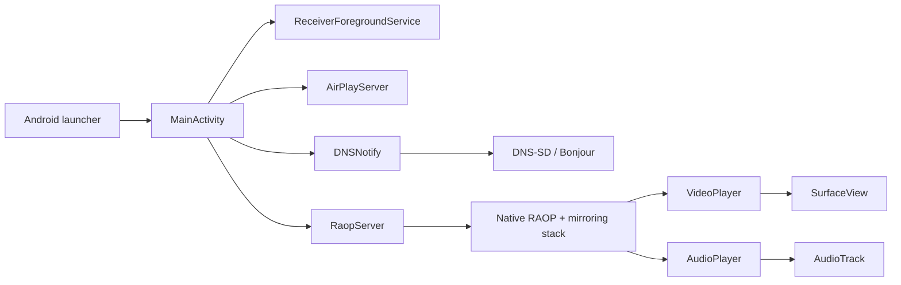

# Receiver Architecture

Receiver is a single-purpose Android application that turns a Lenovo ThinkSmart View into an AirPlay-style receiver. The app is intentionally split into a small Kotlin shell and a native streaming stack.

## Goals

The final application is designed around four constraints:

- It must run on Android 8.1/API 27.
- It targets the Lenovo ThinkSmart View's 8-inch 1280x800 WVA touchscreen.
- It must launch directly into receiver mode with no control UI.
- It must advertise itself using the name of the Android device it is running on.
- It must keep the hot media path as lean as possible on ThinkSmart View hardware.

## Runtime Overview

At launch, `MainActivity` creates the playback surface, enters immersive full-screen mode, starts a foreground keepalive service, and starts both discovery and streaming services.

## Kotlin Application Layer

The Kotlin layer lives under `io.carmo.airplay.receiver`.

`MainActivity` owns lifecycle orchestration. It inflates the playback `SurfaceView`, hides the system bars, starts foreground/awake handling, constructs the receiver services, starts them automatically, and stops them from `onDestroy`. The root view fills the ThinkSmart View's 1280x800 panel, while the video surface is kept at the stream's 16:9 aspect ratio so 1280x720 mirroring is not vertically stretched. It also shows a small startup status overlay with the advertised device name until the first media packet arrives.

`ReceiverForegroundService` is a minimal foreground service used to keep Android treating Receiver as active while it is running. It owns only the ongoing status notification; the media servers still live in `MainActivity`.

`DNSNotify` handles local network service registration. It derives the visible receiver name from Android settings, preferring `Settings.Global["device_name"]`, then Bluetooth name, then a manufacturer/model fallback. The same resolved name is used for AirPlay and RAOP announcements.

`AirPlayServer` is a minimal TCP listener used to provide the AirPlay service port that gets advertised through DNS-SD.

`RaopServer` owns the bridge between Kotlin and the native RAOP stack. It exposes the callback methods invoked from JNI:

- `onRecvVideoData(ByteBuffer, Int, Long, Int, Long, Long)`
- `onRecvAudioData(ByteBuffer, Int, Long, Long)`

It also owns the `SurfaceHolder.Callback` hookup so video decoding starts only once a valid rendering surface exists.

## Media Playback Layer

`VideoPlayer` is a dedicated thread around Android `MediaCodec`. It uses a small fixed-size queue capped at 2 frames and trims pending input to the newest frame so stale frames are dropped instead of allowing latency to grow without limit. It also drains decoder output and renders only the newest waiting output frame. On the ThinkSmart View target it configures H.264 at 1280x720 and renders decoded frames directly to the centered 16:9 `SurfaceView`, leaving black bars on the 1280x800 panel instead of stretching the stream.

`AudioPlayer` is a dedicated thread around `AudioTrack`. It uses `AudioTrack.Builder` on Android 8.1, requests low-latency playback mode where the platform supports it, and writes PCM from direct `ByteBuffer` packets. PCM packets are capped at 4 queued packets and trimmed to 3 pending packets for the same reason as video: when the receiver falls behind, bounded latency is better than endless buffering.

Both playback threads are deliberately small. They do not own Android UI objects other than the render surface, do not perform per-frame logging in normal builds, and do not retain unbounded packet history.

## Native Layer

The native code under `app/src/main/cpp` does the protocol-heavy work:

- RAOP session setup and RTP handling
- FairPlay/pairing support
- AAC decoding through the bundled FDK AAC library
- H.264 mirroring payload handling
- JNI callbacks into `RaopServer`
- DNS-SD JNI support through the trimmed `mDNSResponder` build

Vendored native trees are intentionally pruned. Receiver keeps the Android build inputs needed for playback and discovery, plus required license notices, and removes unused upstream samples, documentation, platform projects, tests, encoder examples, and non-CMake build files. See `docs/vendor-audit.md` for the retained/removal breakdown.

The app links three important native outputs:

- `raop_server`, the JNI bridge
- `play-lib`, the AirPlay/RAOP implementation
- `jdns_sd`, the DNS-SD JNI bridge

The JNI bridge caches callback method IDs once at server startup and reuses thread attachments, avoiding repeated lookup and attach/detach overhead on every audio or video packet. Media callbacks use native-owned direct buffers instead of Java heap arrays; playback releases those buffers after write, decode, or drop.

## Discovery Flow

1. `MainActivity` starts `AirPlayServer` and `RaopServer`.
2. Each service obtains an ephemeral local port.
3. `DNSNotify` publishes `_airplay._tcp` and `_raop._tcp` records.
4. The advertised service name is based on the device name, so AirPlay clients see the ThinkSmart View by its configured Android name.

## Video Flow

1. The native mirror socket receives encrypted H.264 payloads.
2. The native mirror buffer decrypts and normalizes NAL payloads.
3. JNI copies frame bytes into a native-owned direct buffer and invokes `RaopServer.onRecvVideoData`.
4. `RaopServer` enqueues an `NALPacket` into `VideoPlayer`.
5. `VideoPlayer` feeds `MediaCodec` input buffers, releases output buffers to the display surface, and frees the native packet buffer.

## Audio Flow

1. The native RTP socket receives encrypted audio packets.
2. The native RAOP buffer decrypts and decodes AAC to PCM.
3. JNI copies PCM samples into a native-owned direct buffer and invokes `RaopServer.onRecvAudioData`.
4. `RaopServer` enqueues a `PCMPacket` into `AudioPlayer`.
5. `AudioPlayer` writes PCM samples into `AudioTrack` from the direct buffer and frees the native packet buffer.

## Build And CI

The app uses Gradle with the Android Gradle Plugin and Kotlin plugin. Native code is built through CMake and the Android NDK. Release APKs are produced through GitHub Actions rather than relying on a local workstation setup.

GitHub Actions runs the release build:

1. Check out the repository.
2. Install JDK 17.
3. Set up Gradle caching while still using the repository wrapper.
4. Install Android SDK platform 31, build tools 31, CMake 3.22.1, and NDK 25.1.8937393.
5. Run `./gradlew --no-daemon assembleRelease`.
6. Copy the generated APK to `dist/Receiver-release.apk`.
7. Upload the release APK as a workflow artifact.
8. On tag pushes, publish a GitHub Release and attach `Receiver-release.apk`.

The release build type enables both v1 and v2 APK signature schemes so Android 8.1 package installation works with the broadest compatibility. If GitHub repository secrets provide a base64-encoded keystore, the workflow writes it to `app/keystore/receiver-release.p12`, generates a local `signing.properties`, and Gradle signs with that stable key. Without those secrets, Gradle falls back to Android debug signing so CI can still produce an ad hoc sideloadable APK without publishing private key material in the repository.

The launcher icon is generated from `docs/icon-256.png` into density-specific `mipmap-*` PNG assets. The generated Android adaptive icon XML files were removed because Android 8.1 would otherwise prefer those defaults over the project icon.

See `docs/performance.md` for the performance assumptions behind the Kotlin/native split and the Android 8.1 tuning choices.

## Deliberate Omissions

Receiver does not include an in-app start/stop button, device name editor, settings screen, or account system. The intended operating model is simple: launch it when the ThinkSmart View should act as a receiver, and stop it through Android system controls.
