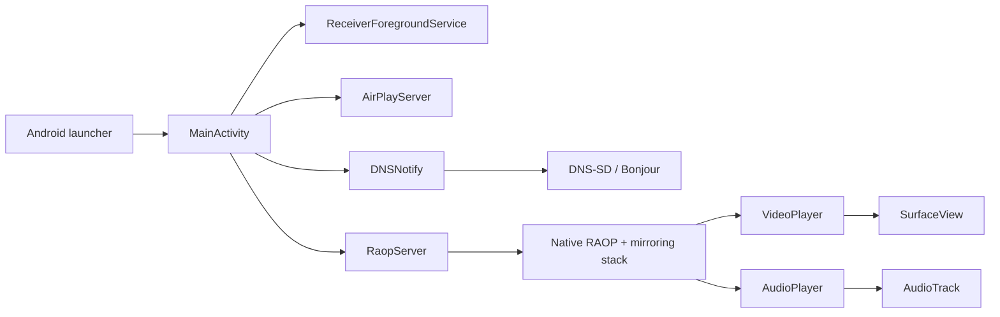

# Receiver Architecture

Receiver is a single-purpose Android application that turns a Lenovo ThinkSmart View into an AirPlay-style receiver. The app is intentionally split into a small Kotlin shell and a native streaming stack.

## Goals

The final application is designed around four constraints:

- It must run on Android 8.1/API 27.
- It targets the Lenovo ThinkSmart View's 8-inch 1280x800 WVA touchscreen.
- It must launch directly into receiver mode with only pre-connection controls.
- It must advertise itself using the name of the Android device it is running on.
- It must keep the hot media path as lean as possible on ThinkSmart View hardware.

## Runtime Overview

At launch, `MainActivity` creates the playback surface, enters immersive full-screen mode, starts a foreground keepalive service, shows the centered startup pane, and starts both discovery and streaming services.

## Kotlin Application Layer

The Kotlin layer lives under `io.carmo.airplay.receiver`.

`MainActivity` owns lifecycle orchestration. It inflates the playback `SurfaceView`, hides the system bars, starts foreground handling, constructs the receiver services, starts them automatically, and stops them from `onDestroy`. The root view fills the ThinkSmart View's 1280x800 panel, while the video surface is kept at the selected stream's 16:9 aspect ratio so mirroring is not vertically stretched. It also shows a centered startup pane with the advertised device name, stream resolution, display wake policy, and audio controls until the first media packet arrives. A small corner label shows the installed app version on the waiting screen.

The stream resolution mode is stored in local preferences:

- `720p` advertises 1280x720 through the AirPlay `/info` response and configures the decoder for that stream size.
- `1080p` advertises 1920x1080 through `/info`, configures the decoder for that stream size, and lets the display surface downscale to the ThinkSmart View panel.

The display wake policy is stored in local preferences:

- `OS default` leaves Android display behavior alone.
- `Always awake` keeps the window and display awake while Receiver is active.
- `Wake on activity` lets the display sleep, then briefly wakes it and brings Receiver forward when significant video activity arrives.

Audio is disabled by default because Receiver prioritizes minimum video latency. Audio acceptance is stored in local preferences, while volume follows Android's media stream volume. If `Accept audio` is off before connection, the RAOP DNS-SD TXT record omits audio format fields, `/info` strips audio format and latency keys, and the native RAOP handler still rejects audio `SETUP` as a fallback instead of merely muting playback. If decoded audio still arrives after a race or client retry, `RaopServer` frees the PCM buffer immediately. If audio is accepted and a stream is active, a right-edge vertical swipe adjusts Android media volume and displays a transient blue vertical volume bar over the video.

`ReceiverForegroundService` is a minimal foreground service used to keep Android treating Receiver as active while it is running. It owns only the ongoing status notification; the media servers still live in `MainActivity`.

`TrafficMonitorView` is a transparent diagnostic overlay in the upper-right corner. It is revealed by dragging in from the top-right edge and dismissed by tapping it. The overlay charts recent media throughput and receiver-side packet latency with neutral outlines plus green throughput and red latency inner strokes. Bandwidth labels adapt between `b/s`, `kb/s`, and `Mb/s`. It deliberately avoids an opaque panel so mirrored slides, documents, or video remain visible underneath.

`DNSNotify` handles local network service registration through Android NSD. It derives the visible receiver name from Android settings, preferring `Settings.Global["device_name"]`, then Bluetooth name, then a manufacturer/model fallback. The same resolved name is used for AirPlay and RAOP announcements. While active, `MainActivity` holds Android's Wi-Fi multicast lock, refreshes DNS-SD registrations on resume, and mirrors registration/failure status onto the startup panel so discovery can be checked without log access.

`AirPlayServer` is a minimal TCP listener used to provide the AirPlay service port that gets advertised through DNS-SD.

`RaopServer` owns the bridge between Kotlin and the native RAOP stack. It exposes the callback methods invoked from JNI:

- `onRecvVideoData(ByteBuffer, Int, Long, Int, Long, Long)`
- `onRecvAudioData(ByteBuffer, Int, Long, Long)`
- `getVideoWidth()`
- `getVideoHeight()`

It also owns the `SurfaceHolder.Callback` hookup so video decoding starts only once a valid rendering surface exists.

For video packets, `RaopServer` scans Annex B start codes for IDR, SPS, and PPS NAL units and reports those as major visual activity. It also reports the first video packet after a short idle period as major activity. Those events are used only by the `Wake on activity` display policy.

For diagnostics, `RaopServer` forwards media byte counts to `TrafficMonitorView` and stamps each Kotlin packet with the local receive time. `AudioPlayer` and `VideoPlayer` report latency when they write audio or release video output for rendering. This measures Receiver's local queue/decode handoff behavior rather than network round-trip or sender-side capture latency.

When the native RAOP connection receives `TEARDOWN`, or the mirror media socket closes, it reports stream stop through JNI. `RaopServer` confirms that no fresh media arrived during a short grace window, then forwards that to `MainActivity`, which exits the app so Receiver returns to Android instead of sitting on a stale black playback surface. It also exits if an established stream goes media-idle for 20 seconds. A closed RTSP control socket alone is not treated as stream end because some senders close or recycle that socket during long-running mirroring; detached native media sessions remain registered with the RAOP server so shutdown can still join their mirror and timing threads before releasing callbacks.

## Media Playback Layer

`VideoPlayer` is a dedicated thread around Android `MediaCodec`. It preserves H.264 input continuity so dependent frames are not dropped before the decoder sees them; if the input queue overflows, Receiver drains pending input and waits for the next keyframe instead of showing corrupted output. It also drains decoder output and renders only the newest waiting output frame. On startup or after codec config changes, Receiver discards the first couple of decoder outputs and keeps the startup pane visible until a real rendered frame is reported. On the ThinkSmart View target it defaults to H.264 at 1280x720 and renders decoded frames directly to the centered 16:9 `SurfaceView`, leaving black bars on the 1280x800 panel instead of stretching the stream. The optional 1920x1080 mode uses the same decode path and relies on the display surface for downscaling without forcing an oversized fixed surface buffer.

`AudioPlayer` is a dedicated thread around `AudioTrack`. It uses `AudioTrack.Builder` on Android 8.1 and writes PCM from direct `ByteBuffer` packets. PCM playback keeps a modest continuity cushion without letting audio dominate receiver latency: it prebuffers 8 packets before starting, uses a 4x platform buffer and blocking writes, and caps PCM packets at 32 queued packets while trimming to 24 pending packets.

Both playback threads are deliberately small. They do not own Android UI objects other than the render surface, do not perform per-frame logging in normal builds, and do not retain unbounded packet history.

## Native Layer

The native code under `app/src/main/cpp` does the protocol-heavy work:

- RAOP session setup and RTP handling
- FairPlay/pairing support
- AAC decoding through the bundled FDK AAC library
- H.264 mirroring payload handling
- JNI callbacks into `RaopServer`
- Legacy DNS-SD JNI compatibility through the trimmed `mDNSResponder` build

Vendored native trees are intentionally pruned. Receiver keeps the Android build inputs needed for playback, plus required license notices and retained compatibility sources, and removes unused upstream samples, documentation, platform projects, tests, encoder examples, and non-CMake build files. See `docs/vendor-audit.md` for the retained/removal breakdown.

The app links three important native outputs:

- `raop_server`, the JNI bridge
- `play-lib`, the AirPlay/RAOP implementation
- `jdns_sd`, the retained DNS-SD JNI compatibility bridge; active Bonjour advertisement is handled by Android NSD in `DNSNotify`

The JNI bridge caches callback method IDs once at server startup and reuses thread attachments, avoiding repeated lookup and attach/detach overhead on every audio or video packet. Media callbacks use native-owned direct buffers instead of Java heap arrays; playback releases those buffers after write, decode, or drop.

## Discovery Flow

1. `MainActivity` starts `AirPlayServer` and `RaopServer`.
2. Each service obtains an ephemeral local port.
3. `DNSNotify` publishes `_airplay._tcp` and `_raop._tcp` records.
4. The advertised service name is based on the device name, so AirPlay clients see the ThinkSmart View by its configured Android name.

## Video Flow

1. The native mirror socket receives encrypted H.264 payloads.
2. The native mirror buffer decrypts and normalizes NAL payloads.
3. JNI copies frame bytes into a native-owned direct buffer and invokes `RaopServer.onRecvVideoData`.
4. `RaopServer` records traffic, stamps the local receive time, and enqueues an `NALPacket` into `VideoPlayer`.
5. `VideoPlayer` feeds `MediaCodec` input buffers, releases output buffers to the display surface, reports receiver-side latency, and frees the native packet buffer.

## Disconnect Flow

1. The sender sends `TEARDOWN`, or the mirror media socket closes.
2. Native RAOP invokes the `stream_stopped` callback.
3. JNI calls `RaopServer.onStreamStopped()`.
4. `RaopServer` waits briefly; if no new media packet arrives, it forwards the stop.
5. `MainActivity` finishes and `onDestroy` stops DNS-SD advertisement, AirPlay/RAOP services, foreground notification, wake locks, and players.

## Audio Flow

1. The native RTP socket receives encrypted audio packets.
2. If audio is disabled, the native RAOP handler rejects audio setup before RTP audio starts.
3. Otherwise, the native RAOP buffer decrypts and decodes AAC to PCM.
4. JNI copies PCM samples into a native-owned direct buffer and invokes `RaopServer.onRecvAudioData`.
5. `RaopServer` records traffic, stamps the local receive time, and enqueues a `PCMPacket` into `AudioPlayer`.
6. `AudioPlayer` writes PCM samples into `AudioTrack` from the direct buffer at the configured local volume, reports receiver-side latency, and frees the native packet buffer.

## Build And CI

The app uses Gradle with the Android Gradle Plugin and Kotlin plugin. Native code is built through CMake and the Android NDK. Release APKs are produced through GitHub Actions rather than relying on a local workstation setup.

GitHub Actions runs the release build:

1. Check out the repository.
2. Install JDK 17.
3. Set up Gradle caching while still using the repository wrapper.
4. Install Android SDK platform 31, build tools 31, CMake 3.22.1, and NDK 25.1.8937393.
5. Run `./gradlew --no-daemon assembleRelease`.
6. Copy the generated APK to `dist/Receiver-release.apk`.
7. Upload the release APK as a workflow artifact.
8. On tag pushes, publish a GitHub Release and attach `Receiver-release.apk`.

The release build type enables both v1 and v2 APK signature schemes so Android 8.1 package installation works with the broadest compatibility. If GitHub repository secrets provide a base64-encoded keystore, the workflow writes it to `app/keystore/receiver-release.p12`, generates a local `signing.properties`, and Gradle signs with that stable key. Without those secrets, Gradle falls back to Android debug signing so CI can still produce an ad hoc sideloadable APK without publishing private key material in the repository.

The launcher icon is generated from `docs/icon-256.png` into density-specific `mipmap-*` PNG assets. The generated Android adaptive icon XML files were removed because Android 8.1 would otherwise prefer those defaults over the project icon.

See `docs/performance.md` for the performance assumptions behind the Kotlin/native split and the Android 8.1 tuning choices.

## Deliberate Omissions

Receiver does not include an in-app start/stop button, device name editor, settings screen, or account system. The intended operating model is simple: launch it when the ThinkSmart View should act as a receiver, choose pre-connection behavior on the centered startup pane, and stop it through Android system controls.
