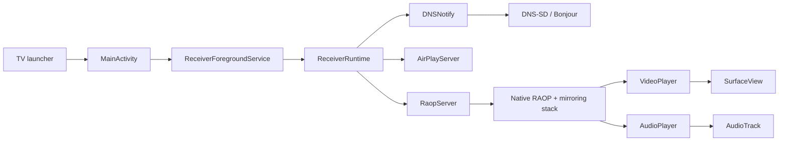

# Receiver Architecture

AirPlay Receiver is a TV-native Android application with a small Kotlin app layer and a native streaming stack. The app is meant to run in the foreground on Android TV / Google TV, advertise itself on the local network, and return to a ready screen after each session.

## Goals

- Target Android TV and Google TV first.
- Keep every core control reachable by D-pad, Select, Back, Home, and remote volume keys.
- Keep the native RAOP, AirPlay, FairPlay, AAC, and mirroring stack intact.
- Keep IP addresses, receiver IDs, and sender history out of the idle UI by default.
- Prepare release builds for Play for TV: target SDK 34+, AAB output, 64-bit native libraries, and 16 KB page-size readiness.

## Runtime Overview

`MainActivity` owns the visible playback surface and TV controls. `ReceiverForegroundService` owns the long-lived `ReceiverRuntime`, so the receiver can keep advertising and handling audio/video while the activity binds and unbinds.

## State Model

`ReceiverState` is the app's state-machine vocabulary:

- `FIRST_RUN`
- `STOPPED`
- `STARTING`
- `IDLE_ADVERTISING`
- `PAIRING`
- `AUDIO_ACTIVE`
- `VIDEO_REQUESTED`
- `WAITING_FOR_SURFACE`
- `VIDEO_STARTING`
- `VIDEO_ACTIVE`
- `VIDEO_STALLED`
- `STOPPING_SESSION`
- `ERROR_RECOVERABLE`

`ReceiverRuntime` records recent `StateTransition` entries for diagnostics and rejects invalid transitions in `isValidTransition()`. `ReceiverSessionStats` tracks duration, rendered video frames, decoder restarts, audio underruns, pre-surface buffering, and the last disconnect reason when known.

`FIRST_RUN` and `PAIRING` are scaffolding states in this pass. First-run is handled by `OnboardingActivity`. Pairing can show a temporary TV PIN placeholder, but discovery remains on the working `pw=false` path and no secure native PIN check is enforced yet.

## Kotlin Application Layer

`MainActivity` inflates the full-screen `SurfaceView`, enters immersive mode, binds to `ReceiverForegroundService`, attaches/detaches the surface, and renders the TV controls.

The ready screen is a dark, D-pad-focusable TV surface. It shows:

- burn-in-conscious clock with subtle pixel shifting
- receiver name
- `Ready to AirPlay`
- a short Control Center / Screen Mirroring hint
- quality profile
- security mode
- Settings and Help actions

The ready screen intentionally does not show local IP address, receiver ID, RAOP prefix, or network diagnostics.

During video playback, the `SurfaceView` fills the screen according to the selected screen-fit mode:

- Fit: preserve aspect ratio with no crop.
- Fill: preserve aspect ratio and crop edges if needed.
- Stretch: fill the display even if aspect ratio changes.

Pressing Select during video shows a remote-first playback overlay with quick actions for Stop, Screen Fit, Diagnostics, and Traffic. Back hides the overlay if visible; otherwise it stops/restarts the receiver and returns to ready. Back from the ready screen exits to the TV launcher.

`OnboardingActivity` is the first Compose screen in this app. It uses `activity-compose`, Jetpack Compose UI primitives, and the AndroidX TV foundation dependency as the migration foothold for future TV-native screens. The flow remains remote-first with welcome, receiver name, security, quality, and connection-instruction steps, and it saves the same preferences used by the main settings screen.

`SettingsActivity` is still XML/ListView based. It is organized into Receiver, Security, Display & Video, Audio, Network, Accessibility, Advanced, and About sections. It can edit receiver naming, persisted trust/block lists, guest mode, takeover protection, quality, screen fit, frame-rate matching, audio sync, audio-only style, visualizer, discovery restart, diagnostics, and receiver identity reset.

`DiagnosticsActivity` displays `ReceiverRuntime.buildDiagnosticsReport()` and supports clipboard copy plus discovery restart. The report includes receiver identity, service names, network address, discovery status, current settings, current state, last session stats, suggestions, disconnect reason, and transition history.

## Preferences

`ReceiverPreferences` wraps all persisted settings:

- receiver name
- first-run completion
- quality profile
- screen fit
- audio sync offset
- wake/display behavior
- start on boot
- after-disconnect behavior
- automatic video takeover
- audio-only screen style
- diagnostics level
- security mode
- guest mode
- takeover protection
- idle clock, reduce motion, frame-rate matching, and visualizer toggles

Quality profiles map to existing `/info` stream-size plumbing. Low Latency, Compatibility, and Audio Stable advertise 720p. Balanced and Best Quality advertise 1080p. Auto uses display capability detection.

Audio sync is stored and surfaced, but the playback delay hook is not applied in `AudioPlayer` yet. The Audio Stable quality profile uses larger Kotlin-side audio prebuffer and platform buffer settings.

## Discovery

`DNSNotify` handles local service registration through Android NSD. It derives the visible receiver name from the custom receiver name, Android device name, Bluetooth name, or manufacturer/model fallback.

The app publishes:

- `_airplay._tcp` on the lightweight `AirPlayServer` port.
- `_raop._tcp` on the native RAOP control port.

Registrations are idempotent. If service name, type, port, and TXT attributes have not changed, refresh does nothing. The TXT `pw` attribute intentionally stays `false` in this phase because native PIN validation is not wired yet.

## Security And Pairing

The security settings model includes:

- Open - no pairing required. This is the only enforced mode in this phase.
- PIN for new devices. Planned native pairing mode.
- PIN every session. Planned native pairing mode.
- Trusted devices only. Planned native pairing mode.

Until native pairing is implemented, DNS-SD stays on the working `pw=false` path. Real security requires native AirPlay pairing support that can:

- generate and display a PIN at connection time
- validate the PIN in the native pairing exchange
- produce stable sender identifiers
- store trusted and blocked devices
- reject blocked or untrusted senders before media starts

`SenderTrustStore` persists trusted and blocked devices using local preferences. The lists are manageable now, but they remain unpopulated and unenforced until native sender identifiers are available. Takeover protection is also a persisted preference only; active sender arbitration still needs native sender identity and connection-gating hooks.

Those native pairing changes are deferred. The settings UI and PIN placeholder make the product model visible without claiming the security boundary is complete.

## Media Playback

`RaopServer` is the JNI bridge between Kotlin and native streaming code. JNI callbacks include:

- `onRecvVideoData(ByteBuffer, Int, Long, Int, Long, Long)`
- `onRecvAudioData(ByteBuffer, Int, Long, Long)`
- `getVideoWidth()`
- `getVideoHeight()`
- `onSetAudioVolume(Float)`
- `onAudioFlush()`
- `onStreamStopped()`

`VideoPlayer` is a dedicated `MediaCodec` thread. It keeps bounded queues sized for the known Android TV startup path, preserves codec config, maintains frame dependencies before decode, drains stale output, and renders the newest decoded frame to the `SurfaceView`.

`AudioPlayer` is a dedicated `AudioTrack` thread. It writes PCM from direct `ByteBuffer` packets, prebuffers a bounded number of packets, uses blocking writes, and trims backlog to avoid unbounded latency.

`SpectrumVisualizerView` renders a low-cost audio-only bar visualizer from media byte samples. It reduces bar count on low-RAM devices, throttles updates, and respects the reduce-motion and visualizer settings.

The hot media path avoids coroutines, UI objects, per-frame logging, and unbounded packet history.

## Disconnect Flow

1. The sender sends `TEARDOWN`, or native media shutdown reaches Kotlin.
2. Native RAOP invokes the stream-stopped callback.
3. JNI calls `RaopServer.onStreamStopped()`.
4. `RaopServer` emits `STOPPING_SESSION`, stores last-session stats, stops players, clears buffers, and emits `IDLE_ADVERTISING`.
5. `MainActivity` shows the ready screen again unless the user selected the legacy exit-to-home after-disconnect behavior.

## Build And Release

The app uses Gradle, the Android Gradle Plugin, Kotlin, CMake, and NDK 25.1.8937393.

Release posture in this pass:

- `compileSdk 34`
- `targetSdk 34`
- `minSdk 27`
- `arm64-v8a` and `armeabi-v7a`
- Compose enabled for onboarding with `activity-compose`, Compose 1.3-era artifacts, and `androidx.tv:tv-foundation:1.0.0-alpha03`
- CMake shared linker flag `-Wl,-z,max-page-size=16384`
- `assembleRelease` for APKs
- `bundleRelease` for Android App Bundles

The AAB keeps 64-bit support for Play compliance and retains 32-bit libraries because some current Android TV devices, including the local Chromecast test target, expose only `armeabi-v7a`.
